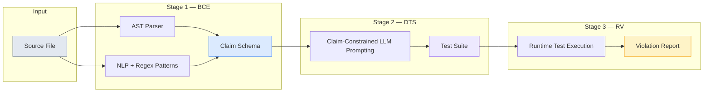
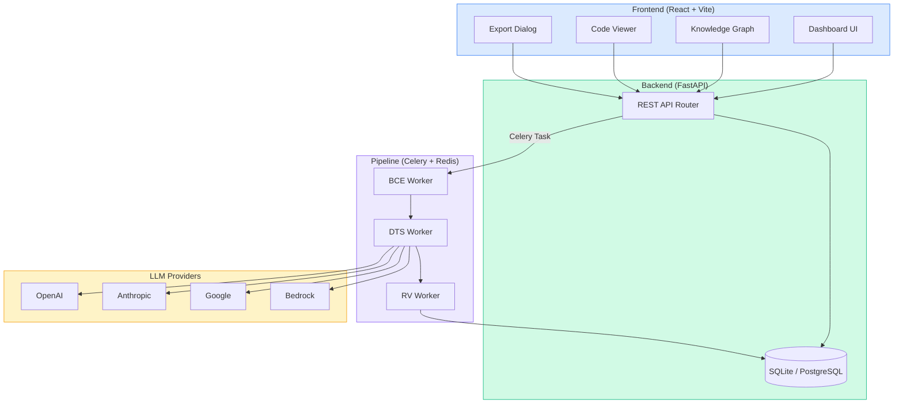

<p align="center">
  
  
  
  
  
</p>

# VeriDoc — Behavioral Contract Violation Detection in LLM-Generated Docstrings

VeriDoc is a three-stage automated pipeline that detects **Behavioral Contract Violations (BCVs)** in LLM-generated docstrings across multiple programming languages. It combines AST analysis, NLP pattern matching, LLM-powered test synthesis, and runtime verification to produce **execution-grounded verdicts** — not LLM opinions.

> **Paper:** *Detecting Behavioral Contract Violations in LLM-Generated Python Docstrings via Dynamic Test Synthesis*

---

## Table of Contents

- [What is a Behavioral Contract Violation?](#what-is-a-behavioral-contract-violation)
- [BCV Taxonomy](#bcv-taxonomy-6-categories)
- [Pipeline Architecture](#pipeline-architecture)
- [System Architecture](#system-architecture)
- [Supported Languages](#supported-languages)
- [Tech Stack](#tech-stack)
- [Features](#features)
- [Prerequisites](#prerequisites)
- [Installation & Setup](#installation--setup)
- [Quick Start](#quick-start--running-your-first-analysis)
- [Sample Output](#sample-output)
- [API Reference](#api-reference)
- [Export Formats](#export-formats)
- [Project Structure](#project-structure)
- [Testing](#testing)
- [Pre-commit Hook](#pre-commit-hook-integration)
- [Authors](#authors)
- [License](#license)

---

## What is a Behavioral Contract Violation?

A BCV occurs when a docstring makes a behavioral assertion that is **demonstrably false** when tested against the actual function. Unlike documentation drift (where docs become stale over time), BCVs are *congenital* — the documentation is incorrect at the moment of generation.

```python
def normalize_list(data: list[float]) -> list[float]:
    """Returns a new list with values scaled to [0, 1].
    Does not modify the input list."""
    # Actually mutates data in-place and returns the same object
    min_val, max_val = min(data), max(data)
    for i in range(len(data)):
        data[i] = (data[i] - min_val) / (max_val - min_val)
    return data  # ← same list, not a new one
```

This contains two BCVs:
- **RSV** (Return Specification Violation) — Claims to return a *new* list, but returns the same object
- **SEV** (Side Effect Violation) — Claims not to modify input, but mutates it in-place

---

## BCV Taxonomy (6 Categories)

| Category | Name | Description | Severity |
|----------|------|-------------|----------|
| **RSV** | Return Specification | Docstring asserts a return type/value that differs from actual output | High |
| **PCV** | Parameter Contract | Docstring imposes input constraints not enforced by the code | High |
| **SEV** | Side Effect | Docstring claims immutability but code mutates arguments | High |
| **ECV** | Exception Contract | Docstring documents exceptions not actually raised | Medium |
| **COV** | Completeness Omission | Docstring omits material behavioral branches | Medium |
| **CCV** | Complexity Contract | Docstring asserts complexity properties contradicted by the code | Low |

---

## Pipeline Architecture



### Stage 1: Behavioral Claim Extractor (BCE)

Extracts verifiable behavioral assertions from docstrings using two parallel tracks:

- **AST Track** — Parses function signatures, return annotations, `raise` statements, and mutation patterns using language-specific parsers
- **NLP Track** — Applies 47 regex patterns over spaCy dependency parses to extract behavioral claims

Each claim is formalized as: `c_i = (τ_i, σ_i, ν_i, κ_i)` — category, subject, predicate-object, conditionality.

### Stage 2: Dynamic Test Synthesizer (DTS)

Converts each extracted claim into an executable test using claim-constrained LLM prompting. The function implementation is **deliberately withheld** from the prompt to prevent the LLM from generating tests that pass by construction.

Supported LLM providers:
| Provider | Model |
|----------|-------|
| OpenAI | GPT-4.1 Mini |
| Anthropic | Claude Sonnet 4 |
| Google | Gemini (gemma-4-31b-it) |
| AWS Bedrock | Claude 3.5 Sonnet |

### Stage 3: Runtime Verifier (RV)

Executes synthesized tests against the actual function using language-specific runtime adapters. Each test produces a binary verdict: **PASS** (claim holds) or **FAIL** (BCV confirmed). Results include full tracebacks, expected vs actual values, and execution timing.

---

## System Architecture



---

## Supported Languages

VeriDoc supports multi-language analysis with dedicated parsers, test framework adapters, and runtime environments:

| Language | Parser | Test Framework | Runtime |
|----------|--------|----------------|---------|
| Python | `ast` module | pytest | Python subprocess |
| JavaScript | Regex-based | Jest | Node.js |
| TypeScript | Regex-based | Jest | Node.js (ts-node) |
| Java | Regex-based | JUnit | javac + java |
| Go | Regex-based | go test | go run |
| Rust | Regex-based | cargo test | cargo run |

Language is auto-detected from file extension (`.py`, `.js`, `.ts`, `.java`, `.go`, `.rs`).

---

## Tech Stack

| Layer | Technology |
|-------|-----------|
| **Frontend** | React 18, TypeScript, Vite, TanStack Query, Tailwind CSS, Framer Motion, D3.js, Recharts, Radix UI, Lucide Icons |
| **Backend** | FastAPI, SQLAlchemy 2.0, Pydantic v2, Alembic |
| **Pipeline** | Celery 5.3, Redis |
| **BCE** | Python AST, spaCy (`en_core_web_sm`), 47 NLP regex patterns |
| **DTS** | OpenAI / Anthropic / Google GenAI / AWS Bedrock SDKs |
| **RV** | Language-specific runtime adapters (pytest, Jest, JUnit, go test, cargo test) |
| **Database** | SQLite (development), PostgreSQL (production) |
| **Export** | JSON, CSV, PDF |

---

## Features

### Dashboard
- Analysis list with real-time status tracking (Pending → BCE → DTS → RV → Complete)
- Animated pipeline progress visualization
- Per-analysis metrics: functions analyzed, claims extracted, violations detected, BCV rate

### Analysis Detail
- **Verification Tab** — Violation breakdown by category and severity, per-function results with expected vs actual values
- **Documentation Tab** — Extracted docstring tree with claim annotations and documentation health scoring
- **Research Tab** — BCV taxonomy reference table, pipeline stage visualization
- **Knowledge Graph** — Interactive D3.js force-directed graph showing relationships between functions, claims, and violations
- **Doc Health Panel** — Documentation accuracy scoring with risk assessment

### Code Viewer
- Syntax-highlighted source code with inline violation annotations
- Extracted docstrings displayed alongside code
- Claim-to-violation mapping

### Export
- **JSON** — Structured report with metadata, executive summary, category/severity breakdown, and detailed violations
- **CSV** — Tabular format with violation IDs, function signatures, severity levels, and claim details
- **PDF** — Professional formatted report with executive summary, metrics, risk assessment, and full violation listing

### Batch Analysis
- Upload ZIP archives or multiple files for batch processing (up to 50 files, 20MB max)
- Automatic language detection per file

### Security
- Rate limiting (10 requests/minute per IP)
- XSS sanitization on source code input
- Language-specific syntax validation
- File size enforcement (1MB default per file)
- API keys stored exclusively in environment variables, never persisted to DB or exposed in responses

---

## Prerequisites

- **Python 3.11+**
- **Node.js 18+** and npm
- **Redis** (running on localhost:6379)
- At least one LLM API key (Google Gemini recommended for quick start)

---

## Installation & Setup

### 1. Clone the repository

```bash
git clone https://github.com/DineshKumarCLG/LLM-Docstrings.git
cd LLM-Docstrings
```

### 2. Backend setup

```bash
cd backend

# Create and activate virtual environment
python -m venv venv

# Windows:
venv\Scripts\activate
# macOS/Linux:
source venv/bin/activate

# Install dependencies
pip install -r requirements.txt

# Download spaCy model (required for BCE NLP track)
python -m spacy download en_core_web_sm
```

### 3. Configure environment variables

Copy the example and add your LLM API key(s):

```bash
cp .env.example .env
```

Edit `backend/.env`:

```env
# At minimum, set ONE of these:
VERIDOC_GOOGLE_API_KEY=your-google-api-key-here

# Optional additional providers:
# VERIDOC_OPENAI_API_KEY=your-openai-key
# VERIDOC_ANTHROPIC_API_KEY=your-anthropic-key
# VERIDOC_AWS_ACCESS_KEY_ID=your-aws-key
# VERIDOC_AWS_SECRET_ACCESS_KEY=your-aws-secret
```

### 4. Initialize the database

```bash
cd backend
alembic upgrade head
```

### 5. Start Redis

Redis must be running for the Celery pipeline to work.

**Windows** (Docker or WSL):
```bash
# Docker
docker run -d -p 6379:6379 redis:alpine

# WSL
wsl -d Ubuntu -e redis-server --daemonize yes
```

**macOS**:
```bash
brew install redis && brew services start redis
```

**Linux**:
```bash
sudo apt install redis-server && sudo systemctl start redis
```

### 6. Start the Celery worker

```bash
cd backend
celery -A app.pipeline.tasks:app worker --loglevel=info --pool=solo
```

> **Windows note:** The `--pool=solo` flag is required on Windows. On Linux/macOS you can omit it.

### 7. Start the backend server

In a new terminal:

```bash
cd backend
uvicorn app.main:app --reload --port 8000
```

### 8. Frontend setup

In a new terminal:

```bash
cd frontend
npm install
npm run dev
```

### 9. Open the application

Navigate to **http://localhost:5173** in your browser.

---

## Quick Start — Running Your First Analysis

1. Open **http://localhost:5173**
2. Click **"New Analysis"**
3. Upload the sample file `examples/sample_bcv.py` or paste Python code with docstrings
4. Select an LLM provider (default: Gemini)
5. Click **"Run Analysis"**
6. Watch the pipeline progress: **BCE → DTS → RV**
7. View results: violations, category breakdown, BCV rate, knowledge graph
8. Click **"View Code"** to see source with inline violation annotations
9. Click **"Export"** to download results as JSON, CSV, or PDF

---

## Sample Output

When analyzing `examples/sample_bcv.py`, VeriDoc detects violations like:

| Function | Category | Claim | Verdict |
|----------|----------|-------|---------|
| `normalize_list` | RSV | "Returns a new list" | FAIL — returns same object |
| `normalize_list` | SEV | "Does not modify the input" | FAIL — mutates in-place |
| `normalize_list` | ECV | "Raises ValueError if empty" | FAIL — returns `[]` |
| `merge_dicts` | SEV | "Neither input dictionary is modified" | FAIL — calls `base.update()` |
| `merge_dicts` | RSV | "Return a new dictionary" | FAIL — returns mutated base |
| `flatten_nested` | CCV | "Runs in O(n) time" | FAIL — O(n×d) due to recursion |

---

## API Reference

### Analysis Endpoints

| Method | Endpoint | Description |
|--------|----------|-------------|
| `POST` | `/api/analyses` | Create new analysis (file upload or code paste) |
| `POST` | `/api/analyses/batch` | Batch analysis (ZIP or multipart, up to 50 files) |
| `GET` | `/api/analyses` | List all analyses |
| `GET` | `/api/analyses/{id}` | Get analysis detail with source code |
| `DELETE` | `/api/analyses/{id}` | Delete analysis and all associated data (cascade) |
| `POST` | `/api/analyses/{id}/rerun` | Re-run analysis with same or different LLM |

### Data Endpoints

| Method | Endpoint | Description |
|--------|----------|-------------|
| `GET` | `/api/analyses/{id}/claims` | Get extracted claims grouped by function |
| `GET` | `/api/analyses/{id}/violations` | Get violation report with category breakdown |
| `GET` | `/api/analyses/{id}/documentation` | Get documentation tree with health scoring |

### Export Endpoints

| Method | Endpoint | Description |
|--------|----------|-------------|
| `GET` | `/api/analyses/{id}/export?format=json` | Download JSON report |
| `GET` | `/api/analyses/{id}/export?format=csv` | Download CSV report |
| `GET` | `/api/analyses/{id}/export?format=pdf` | Download PDF report |

---

## Export Formats

### JSON Export
Structured report with:
- **Report metadata** — generation timestamp, tool version
- **Analysis details** — file, language, LLM provider, status, timestamps
- **Summary** — total functions, claims, violations, BCV rate, pass rate
- **Breakdown** — violations by category and severity with human-readable labels
- **Violations** — full detail including function signature, claim text, expected/actual values, test code, traceback

### CSV Export
Tabular format with columns:
`violation_id`, `function_name`, `function_signature`, `category`, `category_label`, `severity`, `claim_text`, `claim_subject`, `claim_predicate`, `claim_condition`, `outcome`, `expected`, `actual`, `has_test_code`, `has_traceback`

### PDF Export
Professional formatted report with:
- Header with report ID and generation timestamp
- Executive summary with file info, metrics, and risk assessment
- Violation breakdown by severity and category
- Detailed violation listing with word-wrapped text
- Footer with generation metadata

---

## Project Structure

```
LLM-Docstrings/
├── backend/
│   ├── app/
│   │   ├── api/
│   │   │   ├── router.py              # FastAPI REST endpoints
│   │   │   └── documentation.py       # Documentation tree builder
│   │   ├── cli/
│   │   │   └── precommit.py           # Pre-commit hook CLI
│   │   ├── pipeline/
│   │   │   ├── bce/
│   │   │   │   ├── extractor.py       # Behavioral Claim Extractor
│   │   │   │   └── patterns.py        # 47 NLP regex patterns
│   │   │   ├── dts/
│   │   │   │   └── synthesizer.py     # Dynamic Test Synthesizer + LLM clients
│   │   │   ├── rv/
│   │   │   │   └── verifier.py        # Runtime Verifier
│   │   │   ├── parsers/               # Language-specific AST parsers
│   │   │   │   ├── python_parser.py
│   │   │   │   ├── javascript_parser.py
│   │   │   │   ├── typescript_parser.py
│   │   │   │   ├── java_parser.py
│   │   │   │   ├── go_parser.py
│   │   │   │   ├── rust_parser.py
│   │   │   │   └── registry.py        # Parser registry (auto-registration)
│   │   │   ├── frameworks/            # Test framework adapters
│   │   │   │   ├── pytest_adapter.py
│   │   │   │   ├── jest_adapter.py
│   │   │   │   ├── junit_adapter.py
│   │   │   │   ├── gotest_adapter.py
│   │   │   │   ├── cargotest_adapter.py
│   │   │   │   └── registry.py
│   │   │   ├── runtimes/              # Language runtime adapters
│   │   │   │   ├── python_runtime.py
│   │   │   │   ├── nodejs_runtime.py
│   │   │   │   ├── java_runtime.py
│   │   │   │   ├── go_runtime.py
│   │   │   │   ├── rust_runtime.py
│   │   │   │   └── registry.py
│   │   │   ├── language_detector.py   # Auto language detection
│   │   │   └── tasks.py              # Celery pipeline orchestration
│   │   ├── config.py                  # Pydantic settings (env vars)
│   │   ├── database.py                # SQLAlchemy engine & session
│   │   ├── main.py                    # FastAPI app factory
│   │   ├── models.py                  # ORM models (Analysis, Function, Claim, Violation)
│   │   └── schemas.py                 # Pydantic schemas & BCV taxonomy enums
│   ├── alembic/                       # Database migrations
│   ├── tests/                         # 28 test modules (unit + integration + property-based)
│   ├── pyproject.toml                 # Python project config
│   └── .env.example                   # Environment variable template
├── frontend/
│   └── src/
│       ├── api/client.ts              # Axios API client
│       ├── components/
│       │   ├── code/
│       │   │   └── CodeViewer.tsx      # Source code viewer with violation annotations
│       │   ├── dashboard/
│       │   │   ├── KnowledgeGraph.tsx  # D3.js force-directed knowledge graph
│       │   │   ├── VerificationTab.tsx # Violation results & per-function breakdown
│       │   │   ├── DocumentationTab.tsx# Docstring tree & health scoring
│       │   │   ├── ResearchTab.tsx     # Taxonomy reference & pipeline visualization
│       │   │   ├── DocHealthPanel.tsx  # Documentation accuracy panel
│       │   │   └── ...                # Tab navigation, category chips, etc.
│       │   ├── export/
│       │   │   └── ExportDialog.tsx    # JSON/CSV/PDF export dialog
│       │   ├── upload/
│       │   │   ├── FileUploader.tsx    # File upload with drag & drop
│       │   │   └── FolderPicker.tsx    # Folder/batch upload picker
│       │   └── ui/                    # Reusable UI primitives (glass cards, shimmer buttons, etc.)
│       ├── hooks/useAnalysis.ts       # TanStack Query hooks
│       ├── pages/
│       │   ├── DashboardHome.tsx      # Analysis list with status tracking
│       │   ├── AnalysisDetail.tsx     # Results dashboard with tabs & knowledge graph
│       │   ├── CodeViewerPage.tsx     # Code + docstrings + claims
│       │   └── ProjectRunPage.tsx     # Batch/project analysis page
│       └── types/index.ts            # TypeScript type definitions
├── examples/
│   └── sample_bcv.py                 # Sample file with intentional BCVs
└── README.md
```

---

## Testing

The backend includes 28 test modules covering unit tests, integration tests, and property-based tests (using Hypothesis):

```bash
cd backend

# Run all tests
python -m pytest tests/ -v

# Run specific test module
python -m pytest tests/test_api_export.py -v

# Run with coverage
python -m pytest tests/ --cov=app --cov-report=term-missing
```

### Test Categories

| Category | Modules | Coverage |
|----------|---------|----------|
| API endpoints | `test_api_create_analysis`, `test_api_management`, `test_api_export`, `test_api_batch_analysis` | CRUD, export, batch, rate limiting |
| Pipeline stages | `test_bce_properties`, `test_dts_properties`, `test_rv_properties` | Property-based tests for each stage |
| BCE | `test_extractor_smoke`, `test_extract_function_info`, `test_extract_raise_statements`, `test_detect_mutations`, `test_ast_claim_correctness` | Claim extraction accuracy |
| DTS | `test_synthesizer`, `test_dts_prompts`, `test_llm_client` | Test synthesis & LLM integration |
| RV | `test_rv_verifier` | Runtime verification |
| Multi-language | `test_parser_adapters`, `test_frameworks`, `test_runtimes`, `test_language_detector` | Language support |
| Integration | `test_integration`, `test_pipeline_tasks`, `test_cascade_deletion` | End-to-end flows |
| Properties | `test_pipeline_status_properties`, `test_documentation_properties`, `test_precommit_properties` | Invariant checking |

---

## Pre-commit Hook Integration

VeriDoc can run as a `pre-commit` hook to catch BCVs before they enter your codebase:

```yaml
# .pre-commit-config.yaml
repos:
  - repo: local
    hooks:
      - id: veridoc
        name: VeriDoc BCV Check
        entry: python -m app.cli.precommit
        language: python
        types: [python]
```

Or use the installed CLI entry point:

```bash
veridoc-check path/to/file.py
```

---

## Environment Variables

All variables are prefixed with `VERIDOC_`. See `backend/.env.example` for the full template.

| Variable | Required | Default | Description |
|----------|----------|---------|-------------|
| `VERIDOC_GOOGLE_API_KEY` | At least one LLM key | — | Google Generative AI API key |
| `VERIDOC_OPENAI_API_KEY` | At least one LLM key | — | OpenAI API key |
| `VERIDOC_ANTHROPIC_API_KEY` | At least one LLM key | — | Anthropic API key |
| `VERIDOC_AWS_ACCESS_KEY_ID` | Optional | — | AWS access key for Bedrock |
| `VERIDOC_AWS_SECRET_ACCESS_KEY` | Optional | — | AWS secret key for Bedrock |
| `VERIDOC_AWS_REGION` | Optional | `us-east-1` | AWS region for Bedrock |
| `VERIDOC_BEDROCK_MODEL_ID` | Optional | `anthropic.claude-3-5-sonnet-20241022-v2:0` | Bedrock model ID |
| `VERIDOC_DATABASE_URL` | No | `sqlite:///./veridoc.db` | SQLAlchemy database URL |
| `VERIDOC_REDIS_URL` | No | `redis://localhost:6379/0` | Redis URL for Celery broker |
| `VERIDOC_FRONTEND_ORIGIN` | No | `http://localhost:5173` | Allowed CORS origin |

---

## Authors

- **Dinesh Kumar K** — Dept. of AI & Machine Learning, Rajalakshmi Engineering College
- **Keerthana R** — Dept. of AI & Machine Learning, Rajalakshmi Engineering College
- **Prajein C K** — Dept. of AI & Machine Learning, Rajalakshmi Engineering College

---

## License

MIT
