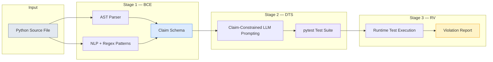
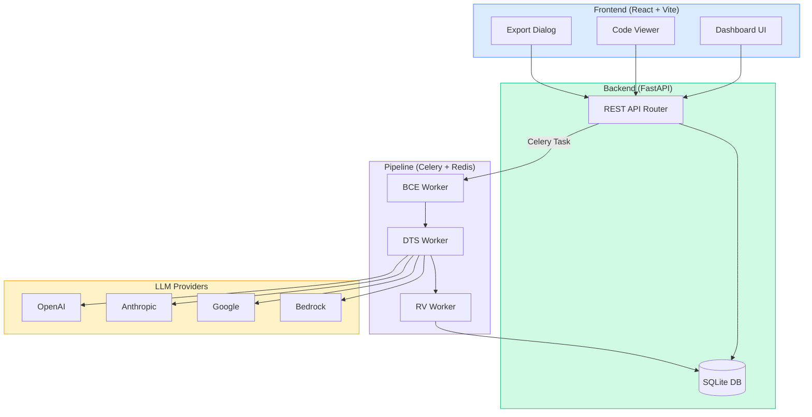

# VeriDoc — Behavioral Contract Violation Detection in LLM-Generated Python Docstrings

VeriDoc is a three-stage automated pipeline that detects **Behavioral Contract Violations (BCVs)** in LLM-generated Python docstrings. It combines AST analysis, NLP pattern matching, LLM-powered test synthesis, and runtime verification to produce execution-grounded verdicts — not LLM opinions.

> **Paper:** *Detecting Behavioral Contract Violations in LLM-Generated Python Docstrings via Dynamic Test Synthesis*

## What is a Behavioral Contract Violation?

A BCV occurs when a Python docstring makes a behavioral assertion that is **demonstrably false** when tested against the actual function. Unlike documentation drift (where docs become stale over time), BCVs are *congenital* — the documentation is incorrect at the moment of generation.

**Example:**
```python
def normalize_list(data: list[float]) -> list[float]:
    """Returns a new list with values scaled to [0, 1].
    Does not modify the input list."""
    # Actually mutates data in-place and returns the same object
    min_val, max_val = min(data), max(data)
    for i in range(len(data)):
        data[i] = (data[i] - min_val) / (max_val - min_val)
    return data  # ← same list, not a new one
```

This contains two BCVs:
- **RSV** (Return Specification Violation): Claims to return a *new* list, but returns the same object
- **SEV** (Side Effect Violation): Claims not to modify input, but mutates it in-place

## BCV Taxonomy (6 Categories)

| Category | Name | Description |
|----------|------|-------------|
| **RSV** | Return Specification | Docstring asserts a return type/value that differs from actual output |
| **PCV** | Parameter Contract | Docstring imposes input constraints not enforced by the code |
| **SEV** | Side Effect | Docstring claims immutability but code mutates arguments |
| **ECV** | Exception Contract | Docstring documents exceptions not actually raised |
| **COV** | Completeness Omission | Docstring omits material behavioral branches |
| **CCV** | Complexity Contract | Docstring asserts complexity properties contradicted by the code |

## Pipeline Architecture



### Stage 1: Behavioral Claim Extractor (BCE)

Extracts verifiable behavioral assertions from docstrings using two parallel tracks:

- **AST Track**: Parses function signatures, return annotations, `raise` statements, and mutation patterns using Python's `ast` module
- **NLP Track**: Applies 47 regex patterns over spaCy dependency parses to extract behavioral claims

Each claim is formalized as: `c_i = (τ_i, σ_i, ν_i, κ_i)` — category, subject, predicate-object, conditionality.

### Stage 2: Dynamic Test Synthesizer (DTS)

Converts each extracted claim into an executable `pytest` test using claim-constrained LLM prompting. The function implementation is **deliberately withheld** from the prompt to prevent the LLM from generating tests that pass by construction.

Supported LLM providers:
- OpenAI GPT-4.1 Mini
- Anthropic Claude Sonnet 4
- Google Gemini 3 Flash
- AWS Bedrock (Claude)

### Stage 3: Runtime Verifier (RV)

Executes synthesized tests against the actual function using pytest's programmatic API. Each test produces a binary verdict: **PASS** (claim holds) or **FAIL** (BCV confirmed). Results include full tracebacks, expected vs actual values, and execution timing.

## System Architecture



## Tech Stack

| Layer | Technology |
|-------|-----------|
| Frontend | React 18, TypeScript, Vite, TanStack Query, Tailwind CSS, Lucide Icons |
| Backend | FastAPI, SQLAlchemy, Pydantic, Alembic |
| Pipeline | Celery, Redis |
| BCE | Python AST, spaCy (en_core_web_sm) |
| DTS | OpenAI / Anthropic / Google GenAI / AWS Bedrock SDKs |
| RV | pytest programmatic API |
| Database | SQLite (development), PostgreSQL (production) |
| Export | JSON, CSV, PDF |

## Prerequisites

- **Python 3.11+**
- **Node.js 18+** and npm
- **Redis** (running on localhost:6379)
- At least one LLM API key (Google Gemini recommended for quick start)

## Installation & Setup

### 1. Clone the repository

```bash
git clone https://github.com/DineshKumarCLG/LLM-Docstrings.git
cd LLM-Docstrings
```

### 2. Backend setup

```bash
cd backend

# Create and activate virtual environment
python -m venv venv
# On Windows:
venv\Scripts\activate
# On macOS/Linux:
source venv/bin/activate

# Install dependencies
pip install -r requirements.txt

# Download spaCy model (required for BCE NLP track)
python -m spacy download en_core_web_sm
```

### 3. Configure environment variables

Edit `backend/.env` and add your LLM API key(s):

```env
# At minimum, set ONE of these:
VERIDOC_GOOGLE_API_KEY=your-google-api-key-here
# VERIDOC_OPENAI_API_KEY=your-openai-key
# VERIDOC_ANTHROPIC_API_KEY=your-anthropic-key
```

### 4. Start Redis

Redis must be running for the Celery pipeline to work.

**Windows** (using WSL or Docker):
```bash
# Option A: Docker
docker run -d -p 6379:6379 redis:alpine

# Option B: WSL
wsl -d Ubuntu -e redis-server --daemonize yes
```

**macOS**:
```bash
brew install redis
brew services start redis
```

**Linux**:
```bash
sudo apt install redis-server
sudo systemctl start redis
```

### 5. Start the Celery worker

```bash
cd backend
celery -A app.pipeline.tasks:app worker --loglevel=info --pool=solo
```

> **Windows note:** Use `--pool=solo` on Windows. On Linux/macOS you can omit it.

### 6. Start the backend server

In a new terminal:

```bash
cd backend
uvicorn app.main:app --reload --port 8000
```

### 7. Frontend setup

In a new terminal:

```bash
cd frontend

# Install dependencies
npm install

# Start development server
npm run dev
```

### 8. Open the application

Navigate to **http://localhost:5173** in your browser.

## Quick Start — Running Your First Analysis

1. Open http://localhost:5173
2. Click **"New Analysis"**
3. Upload the sample file `examples/sample_bcv.py` (or paste Python code with docstrings)
4. Select an LLM provider (default: Gemini 3 Flash)
5. Click **"Run Analysis"**
6. Watch the pipeline progress: BCE → DTS → RV
7. View results: violations, category breakdown, BCV rate
8. Click **"View Code"** to see source with inline violation annotations and extracted docstrings
9. Click **"Export"** to download results as JSON, CSV, or PDF

## Sample Output

When analyzing `examples/sample_bcv.py`, VeriDoc detects violations like:

| Function | Category | Claim | Verdict |
|----------|----------|-------|---------|
| `normalize_list` | RSV | "Returns a new list" | FAIL — returns same object |
| `normalize_list` | SEV | "Does not modify the input" | FAIL — mutates in-place |
| `normalize_list` | ECV | "Raises ValueError if empty" | FAIL — returns [] |
| `merge_dicts` | SEV | "Neither input dictionary is modified" | FAIL — calls base.update() |
| `merge_dicts` | RSV | "Return a new dictionary" | FAIL — returns mutated base |
| `flatten_nested` | CCV | "Runs in O(n) time" | FAIL — O(n×d) due to recursion |

## Project Structure

```
LLM-Docstrings/
├── backend/
│   ├── app/
│   │   ├── api/
│   │   │   └── router.py          # FastAPI REST endpoints
│   │   ├── pipeline/
│   │   │   ├── bce/
│   │   │   │   ├── extractor.py    # Behavioral Claim Extractor
│   │   │   │   └── patterns.py     # 47 NLP regex patterns
│   │   │   ├── dts/
│   │   │   │   └── synthesizer.py  # Dynamic Test Synthesizer + LLM client
│   │   │   ├── rv/
│   │   │   │   └── verifier.py     # Runtime Verifier
│   │   │   └── tasks.py            # Celery pipeline orchestration
│   │   ├── config.py               # Environment settings
│   │   ├── database.py             # SQLAlchemy engine & session
│   │   ├── main.py                 # FastAPI app factory
│   │   ├── models.py               # ORM models (Analysis, Function, Claim, Violation)
│   │   └── schemas.py              # Pydantic schemas & BCV taxonomy enums
│   ├── alembic/                    # Database migrations
│   ├── tests/                      # Backend test suite
│   └── .env                        # Environment variables (API keys)
├── frontend/
│   └── src/
│       ├── api/client.ts           # Axios API client
│       ├── components/
│       │   ├── code/CodeViewer.tsx  # Source code viewer with violation annotations
│       │   ├── export/ExportDialog.tsx
│       │   └── upload/FileUploader.tsx
│       ├── hooks/useAnalysis.ts    # TanStack Query hooks
│       ├── pages/
│       │   ├── DashboardHome.tsx   # Analysis list
│       │   ├── AnalysisDetail.tsx  # Results + charts + violations
│       │   └── CodeViewerPage.tsx  # Code + docstrings + claims
│       └── types/index.ts         # TypeScript type definitions
├── examples/
│   └── sample_bcv.py              # Sample file with intentional BCVs
└── README.md
```

## Pre-commit Hook Integration

VeriDoc can run as a `pre-commit` hook to catch BCVs before they enter your codebase:

```yaml
# .pre-commit-config.yaml
repos:
  - repo: local
    hooks:
      - id: veridoc
        name: VeriDoc BCV Check
        entry: python -m app.cli.precommit
        language: python
        types: [python]
```

## API Endpoints

| Method | Endpoint | Description |
|--------|----------|-------------|
| `POST` | `/api/analyses` | Create new analysis (file upload or code paste) |
| `GET` | `/api/analyses` | List all analyses |
| `GET` | `/api/analyses/{id}` | Get analysis detail with source code |
| `GET` | `/api/analyses/{id}/claims` | Get extracted claims grouped by function |
| `GET` | `/api/analyses/{id}/violations` | Get violation report with category breakdown |
| `GET` | `/api/analyses/{id}/export?format=json\|csv\|pdf` | Export results |
| `DELETE` | `/api/analyses/{id}` | Delete analysis and all associated data |
| `POST` | `/api/analyses/{id}/rerun` | Re-run analysis with same or different LLM |

## Running Tests

```bash
cd backend
python -m pytest tests/ -v
```

## License

MIT

## Authors

- Dinesh Kumar K — Dept. of AI & Machine Learning, Rajalakshmi Engineering College
- Keerthana R — Dept. of AI & Machine Learning, Rajalakshmi Engineering College
- Prajein C K — Dept. of AI & Machine Learning, Rajalakshmi Engineering College
